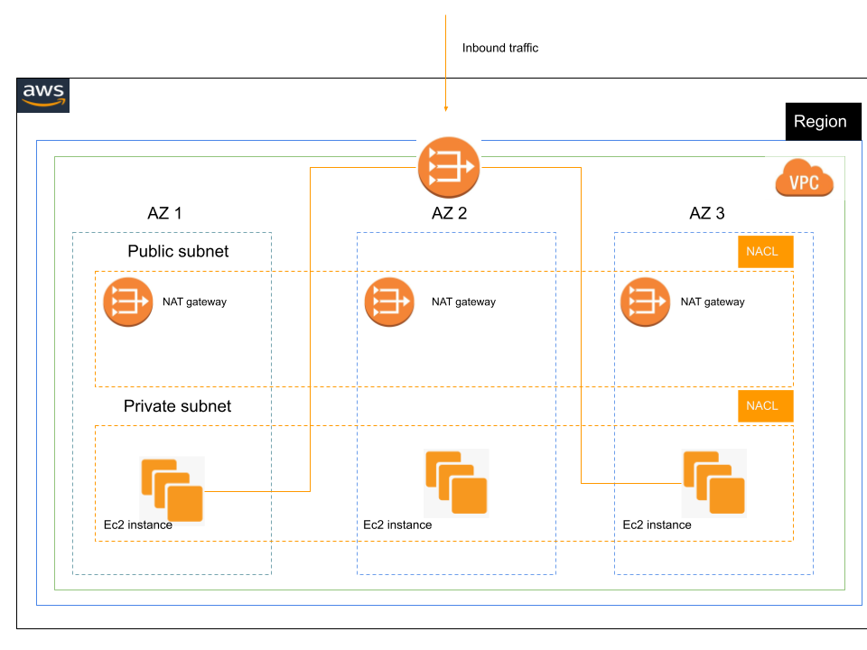

# AWS Virtual Private Cloud (VPC)

Terraform module which creates Virtual Private Cloud (VPC).

## Diagram



## Requirements

| Name      | Version    |
| --------- | ---------- |
| terraform | >= 0.12.26 |
| aws       | >= 2.48    |

## Providers

| Name | Version |
| ---- | ------- |
| aws  | >= 2.48 |

| Phase    | Equivalent `Terraform` Command |
| -------- | ------------------------------ |
| Planning | `terraform plan`               |
| Creation | `terraform apply`              |
| Update   | `terraform apply`              |
| Deletion | `terraform destroy`            |

## Inputs

| Name                               | Description                                                  | Type           | Default          | Required |
| ---------------------------------- | ------------------------------------------------------------ | -------------- | ---------------- | :------: |
| `vpc_cidr`                         | Ip cidr block that will be used as vpc cidr.                 | `string`       | `192.168.0.0/16` |    no    |
| `vpc_name`                         | VPC name.                                                    | `string`       | `''`             |   yes    |
| `private_subnet_cidr`              | Ip cidr block that will be used as private subnet cidr.      | `string`       | `192.168.1.0/24` |    no    |
| `public_subnet_cidr`               | Ip cidr block that will be used as public subnet cidr.       | `string`       | `192.168.2.0/24` |    no    |
| `public_subnet_name`               | Name to be used on public subnet.                            | `string`       | `'`              |   yes    |
| `private_subnet_name`              | Name to be used on private subnet.                           | `string`       | `'`              |   yes    |
| `aws_availability_zones_available` | List of availability zones in a region.                      | `list(string)` | `[]`             |   yes    |
| `private_route_cidr`               | Ip cidr block that will be used as private route table cidr. | `string`       | `''`             |   yes    |
| `public_route_cidr`                | Ip cidr block that will be used as public route table cidr.  | `string`       | `''`             |    no    |
| `tags`                             | A map of tags to add to ECS Cluster                          | `map(string)`  | `{}`             |    no    |

### Outputs

| Name           | Description                                     |
| -------------- | ----------------------------------------------- |
| default_vpc    | Vpc credentials                                 |
| private_subnet | Private subnet credentials                      |
| public_subnet  | Public subnet credentials                       |
| elastic_ip     | Elastic ip associates with the vpc nat gateway. |

## Usage

```hcl
module "aws_vpc" {
  source                           = "./vpc"
  vpc_cidr                         = var.vpc_cidr
  vpc_name                         = var.vpc_name
  public_subnet_cidr               = var.public_subnet_cidr
  public_subnet_name               = var.public_subnet_name
  private_subnet_cidr              = var.private_subnet_cidr
  private_subnet_name              = var.private_subnet_name
  private_route_cidr               = var.private_route_cidr
  public_route_cidr                = var.public_route_cidr
  aws_availability_zones_available = data.aws_availability_zones.available.names
}
```

**NOTE : `terraform.tfvars` file should be created and the above used variables should be initialized it the file.**

## Running locally.

**Clone the repository.**

```
# Initialize terraform.

make init

# Show resources to be created.

make plan

# Create resources.

make apply

```
